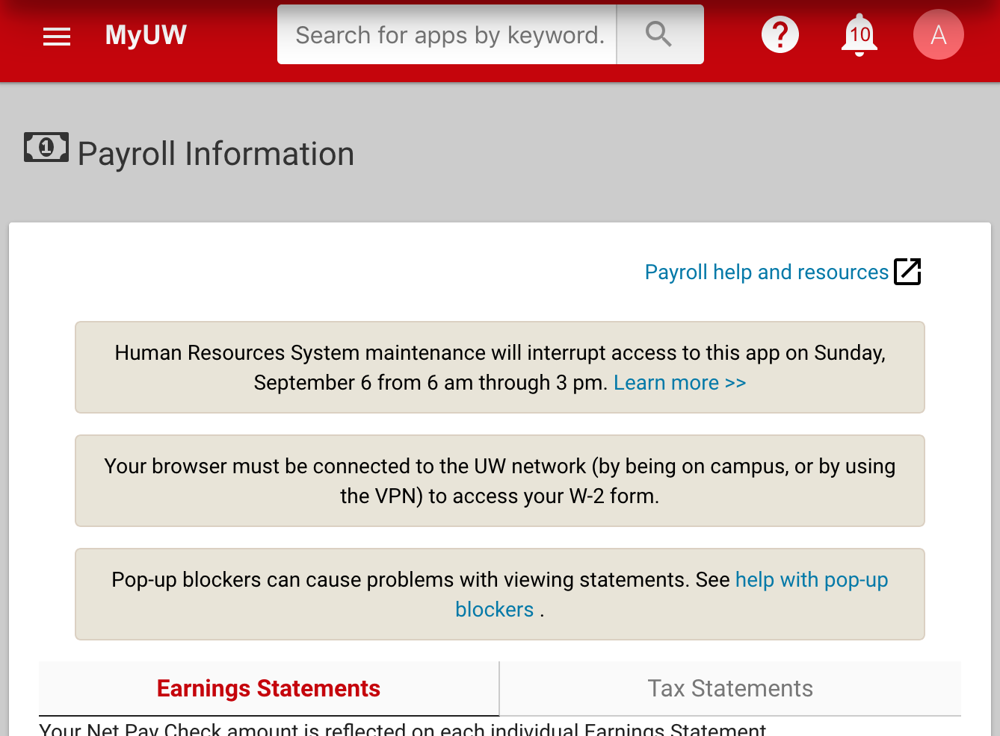

# Messages within the MyUW HRS integration apps

## "notification" feature

Most of the MyUW HRS integration portlets support a feature called
"notification" (an unfortunately overloaded term).
This allows configuring an HTML fragment
as a portlet-preference in the portlet-definition
(so, entities data)
that displays in the Portlets.



### Configuring

`portlet-preference`s define the in-Portlet notifications.

```xml
<portlet-preference>
  <name>notification</name>
  <readOnly>false</readOnly>
  <value><![CDATA[ In-app message as HTML goes here.
]]></value>
</portlet-preference>
```

### Support for multiple messages

`portlet-preference`s can be multi-valued.
Each value describes a single message.
The relevant Portlet will display its messages each in its own box in order.

### Where this works

These 8 Portlets, as published in MyUW, support this feature.

+ Benefit Information (Madison)
  + fname = `university-staff-benefits-statement`
  + defined in `university-staff-benefits-statement.portlet-definition.xml`
+ Benefit Information (UW System)
  + fname = `uw-system-university-staff-benefits-statement`
  + defined in `uw-system-university-staff-benefits-statement.portlet-definition.xml`
+ Payroll Information (Madison)
  + fname = `earnings-statement`
  + defined in `earnings-statement.portlet-definition.xml`
+ Payroll Information (UW System)
  + fname = `uw-system-earnings-statement`
  + defined in `uw-system-earnings-statement.portlet-definition.xml`
+ Personal Information (Madison)
  + fname = `contact-information`
  + defined in `contact-information.portlet-definition.xml`
+ Personal Information (UW System)
  + fname = `uw-system-contact-information`
  + defined in `uw-system-contact-information.portlet-definition.xml`
+ Time and Absence (Madison)
  + fname = `leave-statement`
  + defined in `leave-statement.portlet-definition.xml`
+ Time and Absence (UW System)
  + fname = `uw-system-leave-statement`
  + defined in `uw-system-leave-statement.portlet-definition.xml`

### Limitations

+ The in-HRS-app `notification` appears to all users who access that app.
  There is no audience targeting on these messages.
+ These notifications appear only in the Portlet web applications.
  They do not appear in widgets. They're also not seen by users who are directed
  elsewhere

## Using in-HRS-app messages to communicate about HRS outages

In recent history, we've used the in-HRS-app message feature to foreshadow HRS
outages.

An example of a multi-day outage:

```xml
  <portlet-preference>
    <name>notification</name>
    <readOnly>false</readOnly>
    <value><![CDATA[Human Resources System maintenance will interrupt
    access to this app
    from Saturday, June 26 at 8 am through Monday June 28 at 8 am.
    <a
      href="https://uwservice.wisconsin.edu/news/post/573"
      aria-label="More about the June 26 through 28 Human Resource System outage"
      target="_blank" rel="noopener noreferrer">
      Learn more<span aria-hidden="true"> &gt;&gt;</span>
    </a>
  ]]></value>
  </portlet-preference>
```

An example of a within-one-day outage:

```xml
  <portlet-preference>
    <name>notification</name>
    <readOnly>false</readOnly>
    <value><![CDATA[Human Resources System maintenance will interrupt
    access to this app
    on Sunday, September 6 from 6 am through 3 pm.
    <a
      href="https://uwservice.wisconsin.edu/news/post/591"
      aria-label="More about the September 6 Human Resources System outage"
      target="_blank" rel="noopener noreferrer">
      Learn more<span aria-hidden="true"> &gt;&gt;</span>
    </a>
  ]]></value>
  </portlet-preference>
```

Things to notice:

+ The "Learn more" link is to a news article on the Service Center website.
  The URLs for these articles are sometimes known before the article has been
  published publicly.
+ "Learn more" is a link label with problematic usability,
  especially as consumed out of context, for example by a screen reader jumping
  through hyperlinks on the page. The `aria-label` mitigates this with a clearer
  label of what you're going to get if you follow that link,
  for use by accessibility tooling.
+ The `>>` is a decorative flourish on the "Learn more" link;
  it gives the suggestion of an arrow.
  Because it is decorative rather than semantic,
  it's appropriate to suppress it in accessibility tooling to reduce noise.
